# 三维重建说明文档

本文介绍了从获取数据到生成三维模型的完整流程及相关操作。

> * 部分内容为经验结论，尚未考证，会单独标注出来。强烈建议详细阅读官方文档，有问题上论坛小组提问。
> * 为了更好的掌握重建的参数调整技巧，文中所列相关文档建议全部仔细阅读。

<!-- TOC -->

- [三维重建说明文档](#%E4%B8%89%E7%BB%B4%E9%87%8D%E5%BB%BA%E8%AF%B4%E6%98%8E%E6%96%87%E6%A1%A3)
  - [1. 常用软件](#1-%E5%B8%B8%E7%94%A8%E8%BD%AF%E4%BB%B6)
  - [2. 操作流程](#2-%E6%93%8D%E4%BD%9C%E6%B5%81%E7%A8%8B)
  - [3. 获取重建数据](#3-%E8%8E%B7%E5%8F%96%E9%87%8D%E5%BB%BA%E6%95%B0%E6%8D%AE)
    - [3.1 数据类型](#31-%E6%95%B0%E6%8D%AE%E7%B1%BB%E5%9E%8B)
    - [3.2 如何正确拍摄用于重建的数据以达到最好的效果？](#32-%E5%A6%82%E4%BD%95%E6%AD%A3%E7%A1%AE%E6%8B%8D%E6%91%84%E7%94%A8%E4%BA%8E%E9%87%8D%E5%BB%BA%E7%9A%84%E6%95%B0%E6%8D%AE%E4%BB%A5%E8%BE%BE%E5%88%B0%E6%9C%80%E5%A5%BD%E7%9A%84%E6%95%88%E6%9E%9C)
    - [3.3 参考文档](#33-%E5%8F%82%E8%80%83%E6%96%87%E6%A1%A3)
    - [3.4 示范样例](#34-%E7%A4%BA%E8%8C%83%E6%A0%B7%E4%BE%8B)
  - [4. 软件详解](#4-%E8%BD%AF%E4%BB%B6%E8%AF%A6%E8%A7%A3)
    - [4.1 ffmpeg](#41-ffmpeg)
    - [4.2 Autodesk Recap](#42-Autodesk-Recap)
    - [4.3 Reality Capture](#43-Reality-Capture)
      - [软件界面介绍及基础操作流程](#%E8%BD%AF%E4%BB%B6%E7%95%8C%E9%9D%A2%E4%BB%8B%E7%BB%8D%E5%8F%8A%E5%9F%BA%E7%A1%80%E6%93%8D%E4%BD%9C%E6%B5%81%E7%A8%8B)
      - [操作流程详解](#%E6%93%8D%E4%BD%9C%E6%B5%81%E7%A8%8B%E8%AF%A6%E8%A7%A3)
      - [Parameter Settings](#Parameter-Settings)
      - [Merge Components](#Merge-Components)
      - [Useful Tips](#Useful-Tips)
  - [5. Support](#5-Support)
    - [5.1 Autodesk Recap](#51-Autodesk-Recap)
    - [5.2 Reality Capture](#52-Reality-Capture)

<!-- /TOC -->

## 1. 常用软件

> 部分软件安装包在 **Tools** 文件夹中。

1. [ffmpeg](http://ffmpeg.org/)： 常用的处理视频数据的工具。
2. [Autodesk Recap](https://www.autodesk.com/products/recap/overview)：（学生账号免费）主要用于对Faro的扫描数据进行融合，并导出e57格式的结构化点云数据。
3. Reality Capture：（建议下载最新破解版本）导入多种格式的输入数据，生成模型。
4. CloudCompare：方便快速查看点云的工具。
5. Meshlab：方便快速查看模型的工具。

## 2. 操作流程

1. 获取数据：用Faro，无人机，单反等工具获取数据。详见[获取重建数据](#3-获取重建数据)。
2. 数据处理：用ffmpeg对视频类型的数据进行抽帧处理。详见[ffmpeg：常用命令](#41-ffmpeg)。
3. 数据重建：
   
	a) 对扫描数据，使用Autodesk Recap进行点云之间的align，并导出e57格式的结构化点云数据。详见[Autodesk Recap](#42-autodesk-recap)。

	b) 在Reality Capture中先导入扫描数据，再导入图片数据。并在该软件中完成重建与贴图相关操作。详见[Reality Capture](#43-reality-capture)。
4. 最后导出模型，并根据重建效果以及需求，可以对导出的模型进行调整修改，并导入回Reality Capture重新贴图。

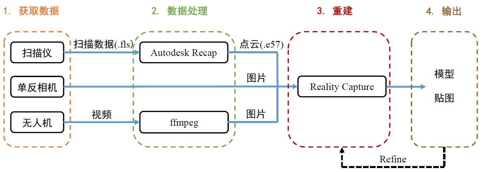

## 3. 获取重建数据

### 3.1 数据类型

1. **照片数据**：用单反相机拍摄raw格式的照片。
2. **视频数据**：用无人机或者Gopro等设备拍摄的视频。
3. **扫描数据**：用Faro等扫描仪获取的点云数据。

### 3.2 如何正确拍摄用于重建的数据以达到最好的效果？

（基于Reality Capture：[官方说明](https://support.capturingreality.com/hc/en-us/articles/115001528211-Taking-pictures-for-photogrammetry)）

* 图像的分辨率越高越好
* 图像清晰，没有失焦，运动模糊，景深效果等等。
* 图像的整体亮度与颜色尽量保持一致
* 图像两两之间保正60%以上的重叠区域 (实验下来需要至少80%以上才能有比较好的align)
* 相邻图像变换角度不超过30°
* 图像拍摄路径尽量首尾相连
* 图像尽量避免原地转动拍摄，需要存在一定的位移
* 图像拍摄角度尽可能多

### 3.3 参考文档
  * Reality Capture软件的帮助文档（软件内窗口右上角下拉的**help**）中 *How to Take Photographs* (**重要**：**相机到目标应该保持的距离-计算工具**)
  * [Full Photogrammetry Guide for 3D Artists](https://80.lv/articles/full-photogrammetry-guide-for-3d-artists/)
  * [Huge scene reconstruction](https://support.capturingreality.com/hc/en-us/articles/360016441831-Huge-scene-reconstruction)

### 3.4 示范样例

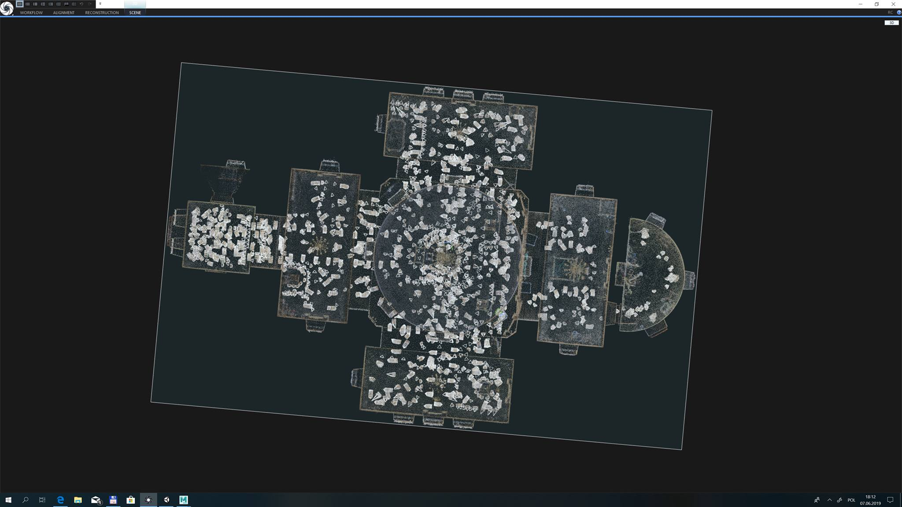

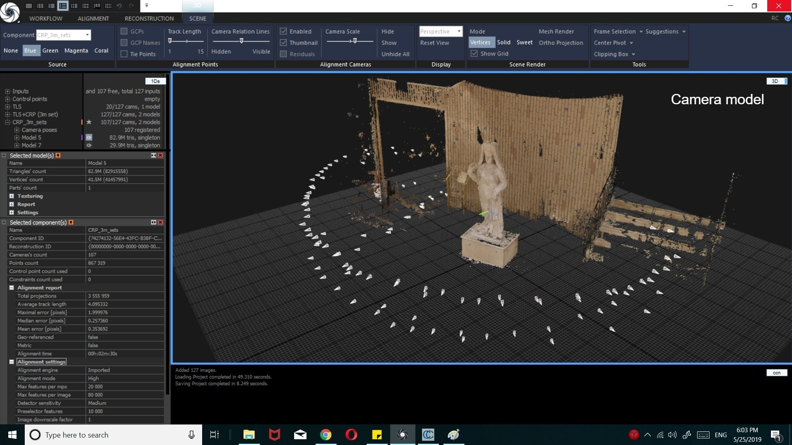

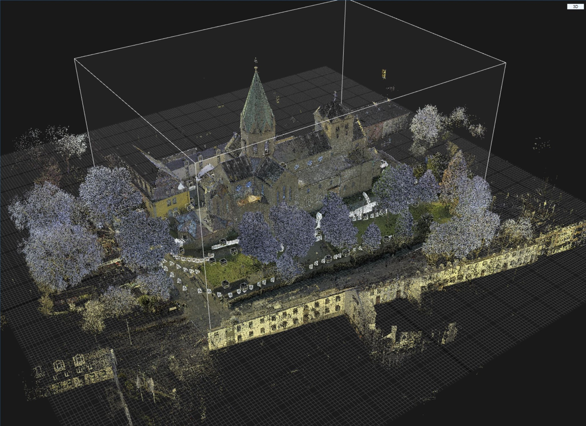

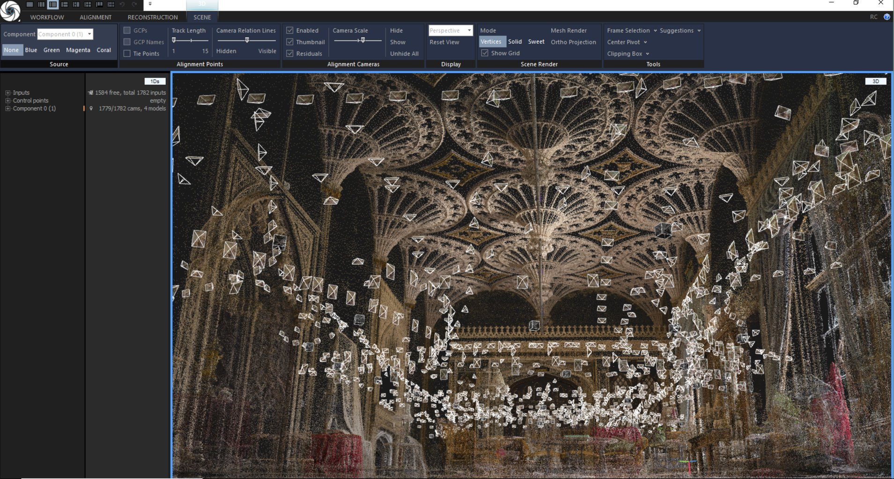

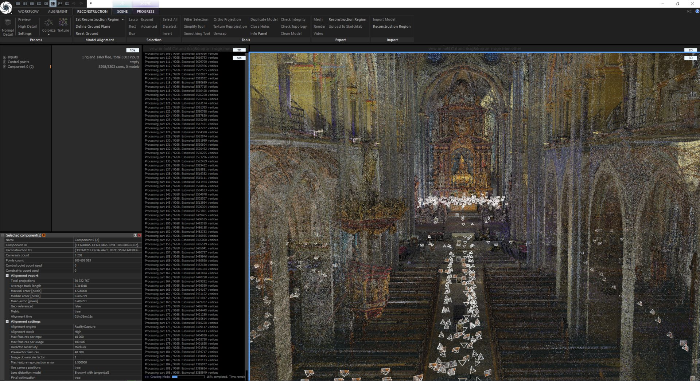

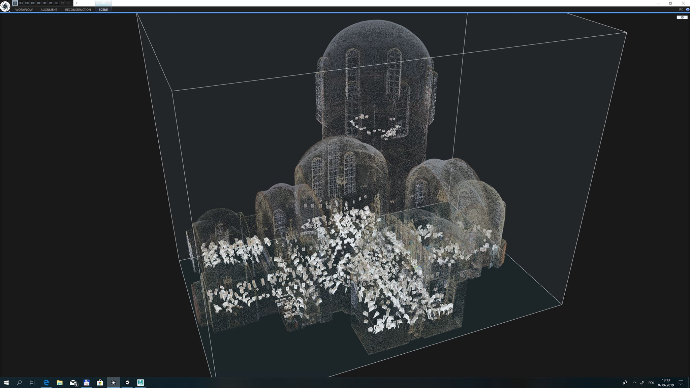

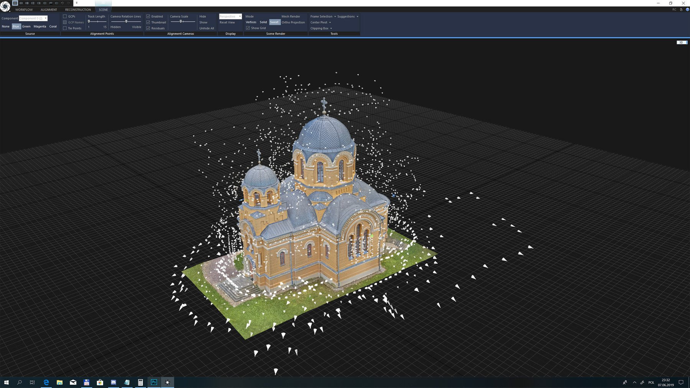

## 4. 软件详解

### 4.1 ffmpeg

* 对视频抽帧

    ```bash
    ffmpeg -i input.mp4 -q:v 2 -vf fps=1 -start_number 0 -ss 00:00:00 -t 10 "./imgs/%04d.jpg"
    ```

    `-q:v` 图像质量。数字越小，图像质量越高。

    `-vf` 所抽帧率 (通常设置为1秒抽1帧，即 `-vf fps=1`)

    `-start_number` 所生成的图片序列开始计数的序号

    `-ss` 起始时间，单位为秒。可以跟两种格式的时间 `00：00：30` 或者 `30`。 不加该参数视为从头开始抽帧.

    `-t` 所抽视频所持续的时间，单位为秒。（-t， -to二选一即可）

    `-to` 所抽视频截止时间，单位为秒。可以跟两种格式的时间 `00：00：30` 或者 `30`。 不加该参数视为抽至视频结尾。

### 4.2 Autodesk Recap

Simply follow the software's instructions.

1. Import scan data:

   * `new Project` -> `import point cloud` ->
   * Enter a project name and select a place to save files -> `proceed` ->
   * Drag Faro (`.fls`) files into `drag files or folders here` (note: `fls` files can only be imported in this way)-> `import files`
     
   (The import process will take a very long time. )

2. Register Scans:

   * Click `auto register scans`. If the scans have good overlap, then the software can auto register the scans, otherwise you will manually register them.
   * You can find the registration report at the bottom of the screen. Make sure that all scans have good registration -- _Green font_ 
   * Click `index scans` -> `launch project`

3. Export point cloud:

   * note: No editing to the point cloud, such as point cloud cleaning, resizing etc. If the point cloud has been modified, then we can only export unstructured point cloud, which might cause problems when re-importing it into Reality Capture. 
   * See [Structured and Unstructured File Formats](https://help.autodesk.com/view/RECAP/2018/ENU/?guid=GUID-C4E7FC11-9B31-4FFF-8C54-89EBCEE3C6B6)
   * `Export`: select `e57`

### 4.3 Reality Capture

#### 软件界面介绍及基础操作流程

1. [UserInterface](https://www.youtube.com/watch?v=Njmucg97FV8&feature=youtu.be)
2. [用图片重建模型](https://www.youtube.com/watch?v=r3OF7LcmcaA)
3. [结合扫描数据和图片重建模型](https://www.youtube.com/watch?v=M6Uf8kjfbSA)
4. [结合扫描与无人机数据重建模型](https://www.youtube.com/watch?v=-CwdugODkmQ)

#### 操作流程详解

If you have scan data, then start from step 1, otherwise skip to step 5:

**Align:**

1. Open a new RC project and import _**scans**_: `WORKFLOW` -> `Import & Metadata` -> `Laser Scan` -> select the merged e57 point cloud.
2. Align scans: `ALIGNMENT` -> `Registration` -> `Align Images`.
3. You will get a new component on the left panel and rename it.
4. Export the scan alignment component: `Alignment` -> `Export` -> `Registration` -> select the first format `Reality Capture alignment component` -> **'xxx_scan.rcalign'**.
5. Open a new RC project and import _**pictures**_: `WORKFLOW` -> `1.Add imagery` -> `Folder/Inputs`.
6. (**Important**) Configure alignment settings: `WORKFLOW` -> `Registration` -> `settings` -> `Alignment Settings`. See [Parameter Settings]((#parameter-settings)) for more information. **Do not modify the defalt settings, unless you know what you are doing!**
7. Align scans: `ALIGNMENT` -> `Registration` -> `Align Images`.
8. You will get a few components on the left panel.
9. Analyze the components:
   1. Check every component you have. If there is obvious misalignment, then return to step 6 to reconfigure the alignment settings and align again. See [tip](https://www.youtube.com/watch?v=ESgD3UIGLaE).
   2. Usually you will get several componenents. If you have only one, then skip to step 10.
   3. If there is a component that contains most of the images (Ex. 900 of 1000 pics), then ignore or delete the rest small components and go to step 10.
   4. If we are not in ANY case above, then we are facing the most time-consuming process: _Merge components_. Follow instructions in section [Merge Components](#merge-components).
10. Export the image alignment component: `Alignment` -> `Export` -> `Registration` -> select the first format `Reality Capture alignment component` -> **'xxx_pics.rcalign'**.
11. Merge all the components we have, including scan components and image components. Save the new component, in case the software craches.

**Reconstruct:**

1. Select the all-merged component.
2. Turn the model into the right position of the coorinate system: `RECONSTRUCTION` -> `Model Alignment` -> `Defien Ground Plane`。
3. Define a reconstruction region: `RECONSTRUCTION` -> `Model Alignment` -> `Set Reconstruction Region`. (Note: The region can be exported and imported. See `RECONSTRUCTION` -> `Export/Import`.)
4. Perform reconstruction: `RECONSTRUCTION` -> `Normal Detail`. (Note: The other two modes are almost useless. `Preview` generates shit and `High Detail` takes infinite time :( , in default settings.)
5. (optional) Simpify/Smooth/Filter: `RECONSTRUCTION` -> `Tools`
6. (optional) Colorize: `RECONSTRUCTION` -> `process` -> `Colorize`
7. (optional) Texture: `RECONSTRUCTION` -> `process` -> `Texture`. For more information on _colorize_ and _texture_, see **Coloring and Texturing** in the help pannel.
8. Export:  `RECONSTRUCTION` -> `Mesh`. Select the format you want to export, and configure the texutre export settings if the model is texutred. For more information on configuration, see [Parameter Settings]((#parameter-settings)).

#### Parameter Settings

If you don't know how to configure the setting, just go with the default, which is usually already the best configuration.

1. Alignment Settings:

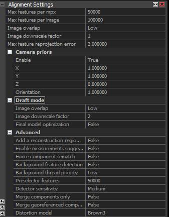

`Image overlap`:


It defines how good the scanned object is covered by the taken images. By default, this is set to Medium.

Medium overlap can be set if all the images in the dataset have at least 70-80% overlap with the nearest images. If you have a small dataset, it will likely be split into many components (groups of connected and aligned images).

* Try _middel_(default) first.

`Max feature reprojection error`:

* Rarely change the default setting: `2.0`
* If there is a trivial misalignment, you might consider a smaller value like `1.8`. If the misalignmet is obvious, then you cannot get a better alignment by adjusting this parameter.

`Force component rematch`:

* Select `True`, when merging components.

`Preselector features`:

* If there are multiple components or no proper alignment, try increasing this number.

`Detector sensitivity`: 

It defines how fine and how many features (unique spots of the object) RC will try to detect. Example: for rich granite texture, you can use Low sensitivity. For subtle white marble texture, you will have to use High sensitivity.

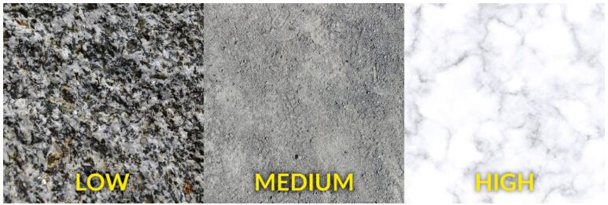

Ultra-high sensitivity is rarely used. It can be used in studio facial or body scans. It is better not to set a higher sensitivity than the required or you can have too many false positive errors.

2. Reconstruction Settings:

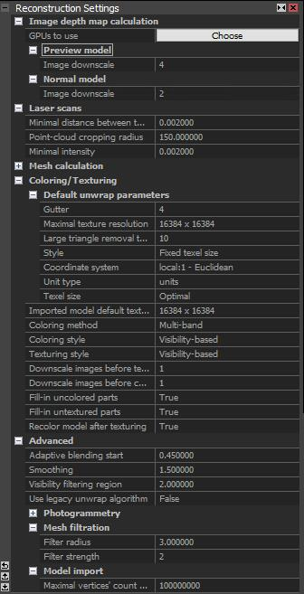

`Image downscale`: larger number will increase the 

3. Export Settings:
   
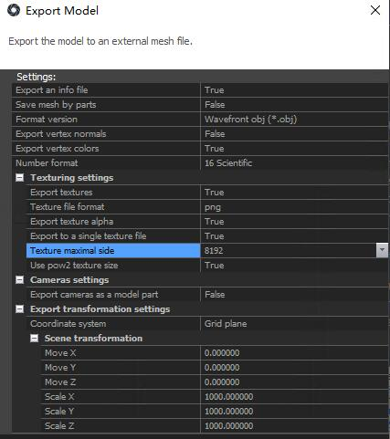

`Export to a single texture file`: 

* _True_ export a single textrue file, and you can define the texture resolution (`Texture maximal side`) in the upcoming parameter.
* _False_ export multiple texture file.

#### Merge Components

1. Read some not very helpfull official tutorials: 
   1. [Working with Components: Merging components](https://support.capturingreality.com/hc/en-us/articles/115001569011-Working-with-Components-Merging-components)
   2. [How to put together more components?](https://support.capturingreality.com/hc/en-us/articles/115001485012-How-to-put-together-more-components-)
2. If you have watched the videos I attatched above, you should know the basic steps to merge components.

#### Useful Tips

一些很实用的小技巧建议掌握：

1. **SAVE ALL THE TIME!** 一定要时刻保存，目前软件还存在很多bug，偶尔会崩溃。
2. 基操 [Work with Control Points](https://www.youtube.com/watch?v=d8naLEtLqDY&t=4s)
3. 炫酷 [Some tips and tricks for RealityCapture Control Point workflow](https://www.youtube.com/watch?v=yk1SUEJdsI8&feature=share)
4. [RealityCapture UI/UX: Examination alignment result](https://www.youtube.com/watch?v=ESgD3UIGLaE)

## 5. Support

### 5.1 Autodesk Recap

1. [论坛](https://support.capturingreality.com/hc/en-us)
   > 活跃度较低
2. [帮助文档](https://help.autodesk.com/view/RECAP/2018/ENU/?guid=GUID-91810DA7-71F5-4C6C-989C-790455B7C847)
   > 缺少部分功能

### 5.2 Reality Capture

1. [论坛](https://support.capturingreality.com/hc/en-us)
   > 活跃度低，适合先用来搜索是否有人提过类似的问题。如果问题不紧急可以考虑在此提问，一般需要等待数天。
2. Facebook Group []()
   > 活跃度很高，基本上当天能得到答复。如果在论坛上找不到解决方案，可以考虑在group里提问。
